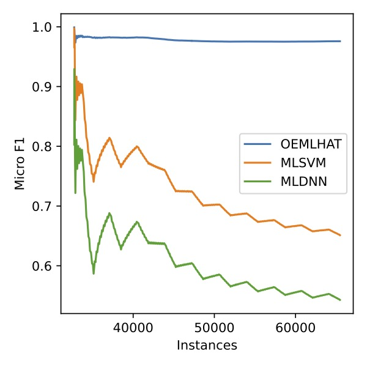

# OEMLHAT4PdM: Online Ensemble of Multi-Label Hoeffding Trees for Predictive Maintenance

Associated repository with complementary material to the manuscript *Simultaneous fault prediction in evolving industrial environments with ensembles of Hoeffding adaptive trees*, submitted to the Applied Intelligence journal. The following materials are included:

* Source code of the OEMLHAT proposal.
* Datasets used in the experimentation.
* Complete table of results.
* Complete instructions to execute the model and reproduce the experimentation.

## Source code

The purpose of this repository is to make public and accesible the source code of OEMLHAT. This includes the dependencies of the library and the necessary instructions to use it.

The source code of OEMLHAT is available under the file [src/oemlhat](src/oemlhat.py). And a complete tutorial for its execution is presented in the [Tutorial notebook](src/tutorial.ipynb)

```python
from oemlhat import OEMLHAT

learner = OEMLHAT(
    n_models = 10,
    subspace_size = 0.6,
    lam = 5,
    grace_period = 205,
    delta = 2.5093683326920607e-07,
    tau = 0.05,
    cardinality_th = 135,
    entropy_th = 0.75,
    drift_window_threshold = 208,
    perf_metric = MicroAverage(F1()),
    switch_significance = 0.036,
    lc_n_neighbors = 13,
    lc_window_size = 140,
    hc_lr = 0.95,
)
```

## Datasets

OEMLHAT's performance has been tested on three public predictive maintenance problems belonging to the machine learning field of the multi-label classification. All of them are available in this repository under the [datasets](datasets) folder. The dataset information from a point of view of multi-label learning is the following:

| Case study | Reference | Stream length | Numerical features | Categorical features | Labels | Cardinality | Density |
|-----------|-----|-----------------|----------------------|------------------------|--------|-------------|---------|
| Ai4i      | [UCI repository](https://archive.ics.uci.edu/ml/datasets/AI4I+2020+Predictive+Maintenance+Dataset) | 10,000          | 5                    | 1                      | 5      | 3.75e-2     | 7.46e-3 |
| NPS     | [UCI repository](https://archive.ics.uci.edu/dataset/316/condition+based+maintenance+of+naval+propulsion+plants) | 65,473          | 25                   | 0                      | 4      | 2.00        | 0.50    |
| ALPI   | [IEEE dataport](https://ieee-dataport.org/open-access/alarm-logs-packaging-industry-alpi) | 3,395           | 36                   | 0                      | 47     | 2.83        | 6.16e-2 |

Moreover, they can be loaded as data stream in River framework using the functions under the folder [src/datasets](src/datasets/)

```python
from datasets.multioutput import Ai4i

stream = Ai4i()

x, y = next(iter(stream))
```

## Results

The complete results of the experimentation carried out in this work and presented and discussed in the associated paper are available in CSV format for downloaading in the [results](results) folder. The results are summarized and detailed by study below.

### Study 1: Evaluating existing online multi-label classification methods in predictive maintenance problems with simultaneous failures in comparison with OEMLHAT

The average results are the following:

| Method | Subset acc | Hamming loss | Example F1 | Example precision | Example recall | Micro F1 | Micro precision | Micro recall | Macro F1 | Macro precision | Macro recall |
|---|---|---|---|---|---|---|---|---|---|---|---|
| AMR | 0.9500 | 0.0097 | 0.9506 | 0.9758 | 0.9683 | 0.2533 | 0.2960 | 0.2214 | 0.1702 | 0.1967 | 0.1509 |
| kNN | 0.9650 | 0.0063 | 0.9656 | 0.9914 | 0.9689 | 0.3615 | 0.7074 | 0.2427 | 0.1911 | 0.4993 | 0.1630 |
| HT | 0.9599 | 0.0075 | 0.9602 | 0.9893 | 0.9656 | 0.2252 | 0.4843 | 0.1467 | 0.1000 | 0.5033 | 0.0952 |
| HAT | 0.9599 | 0.0075 | 0.9602 | 0.9893 | 0.9656 | 0.2252 | 0.4843 | 0.1467 | 0.1000 | 0.5033 | 0.0952 |
| ARF | 0.9661 | 0.0062 | 0.9665 | 0.9927 | 0.9684 | 0.3517 | 0.7831 | 0.2267 | 0.1749 | 0.7965 | 0.1496 |
| AMF | 0.9673 | 0.0059 | 0.9678 | 0.9924 | 0.9703 | 0.4161 | 0.7871 | 0.2828 | **0.2480** | 0.6249 | 0.1938 |
| MLHT | 0.9604 | 0.0074 | 0.9604 | **0.9950** | 0.9604 | 0.0000 | **0.9950** | 0.0000 | 0.0000 | **0.9950** | 0.0000 |
| iSOUPT | 0.9458 | 0.0107 | 0.9471 | 0.9699 | 0.9702 | 0.2794 | 0.2786 | 0.2801 | 0.1954 | 0.1957 | **0.1952** |
| MLHAT | 0.9498 | 0.0095 | 0.9501 | 0.9823 | 0.9627 | 0.0940 | 0.1595 | 0.0667 | 0.0638 | 0.1023 | 0.0466 |
| OEMLHAT | **0.9680** | **0.0057** | **0.9690** | 0.9930 | **0.9708** | **0.5075** | 0.8768 | **0.3571** | 0.1820 | 0.8734 | 0.1769 |

The detailed results per problem are available in the following files:

* [results/study1_results_ai4i.csv](results/study1_results_ai4i.csv): complete results for the Ai4i case study.
* [results/study1_results_nps.csv](results/study1_results_nps.csv): complete results for the NPS case study.
* [results/study1_results_alpi_average.csv](results/study1_results_alpi_average.csv): average results for the ALPI case study considering all the machines. The detailed results per machine are available in the same location under the name *study1_results_alpi_X.csv*, where *X* goes from 0 to 19 indicating the ID of the machine.

### Study 2: Evaluating previous approaches applied to PdM problems with simultaneous failures in comparison with OEMLHAT and the online approach

The second study compares the performance of OEMLHAT against proposals in the literature that have addressed each case study. The average results are shown below.

| Case | Method | Subset acc | Hamming loss | Example F1 | Example precision | Example recall | Micro F1 | Micro precision | Micro recall | Macro F1 | Macro precision | Macro recall |
|---|---|---|---|---|---|---|---|---|---|---|---|---|
| Ai4i | MLLionF | 0.9820 | **0.0038** | **0.9831** | 0.9966 | 0.9855 | 0.4607 | 0.7069 | 0.3417 | **0.2644** | 0.6158 | 0.4047 |
|  | ExplBagDT | 0.9645 | 0.0076 | 0.9651 | 0.9993 | 0.9656 | 0.2508 | **0.9048** | 0.1456 | 0.1986 | **0.9636** | 0.1370 |
|  | MLSVM | 0.9784 | 0.0047 | 0.9784 | **0.9994** | 0.9790 | 0.0781 | 0.6250 | 0.0417 | 0.2444 | 0.9250 | 0.2270 |
|  | OEMLHAT | **0.9824** | **0.0038** | 0.9828 | 0.9964 | **0.9863** | **0.4751** | 0.7049 | **0.3583** | 0.2604 | 0.3709 | **0.4108** |
||||||||||||||
| NPS | MLDNN | 0.0813 | 0.4429 | 0.6769 | 0.6094 | 0.6891 | 0.6512 | 0.6115 | 0.6965 | 0.5717 | 0.7123 | 0.7500 |
|  | MLSVM | 0.0494 | 0.5000 | 0.6514 | 0.5937 | 0.5087 | 0.5429 | 0.5937 | 0.5000 | 0.3725 | 0.7969 | 0.5000 |
|  | OEMLHAT | **0.9076** | **0.0229** | **0.9753** | **0.9728** | **0.9854** | **0.9758** | **0.9694** | **0.9824** | **0.9719** | **0.9646** | **0.9796** |
||||||||||||||
| ALPI | FORMULA | 0.0829 | 0.0954 | 0.4026 | 0.4636 | 0.7689 | 0.4190 | 0.3528 | 0.5436 | 0.2624 | **0.7223** | 0.3322 |
|  | BATOCDM | 0.0783 | 0.0879 | 0.4051 | 0.4475 | **0.7712** | 0.4203 | 0.3589 | 0.5269 | 0.2434 | 0.7003 | 0.3187 |
|  | OEMLHAT | **0.3277** | **0.0423** | **0.6398** | **0.7668** | 0.7660 | **0.6359** | **0.6819** | **0.6063** | **0.6180** | 0.7012 | **0.5913** |

In addition, the degradation of the static models vs. our incremental proposal is shown below for each dataset.

#### Ai4i case study


#### NPS case study



#### ALPI case study

Machine 0


Machine 1


The complete list of machines are available under the [results](results) folder with the name *paperpdm_onlinevsoffline_Alpi-X* where *X* goes from 0 to 19.

## Reproductible experimentation

All the experimentation has been carried out in Python, using for the comparative analysis in the online learning paradigm the implementations available in [River](https://riverml.xyz) of the main multi-label methods. The methods together with their configurations are the following:

| Family   | Acronym | Algorithm  | Configuration |
|---------|----|------------|--------|
| BR+Rules  | AMR | [Adaptive Model Rules](https://riverml.xyz/latest/api/rules/AMRules/)  | `n_min` = 200, `delta` = 1e-7, `tau` = 0.05, `pred_model` = Logistic Regression, `splitter` = TEBST, `drift_detector` = ADWIN, `fading_factor` = 0.99, `anomaly_threshold` = -0.75, `m_min` = 30, `ordered_rule_set` = True, `min_samples_split` = 5 |
| BR+Distance | kNN | [k-Nearest Neighbors](https://riverml.xyz/latest/api/neighbors/KNNClassifier/)  | `n_neighbors` = 5, `window_size` = 200, `weighted` = True, `dist_func` = Euclidean |
| BR+DT   | HT | [Hoeffding Tree](https://riverml.xyz/latest/api/tree/HoeffdingTreeClassifier/)   | `grace_period` = 200, `delta` = 1e-7, `max_depth` = None, `split_criterion` =  Information Gain, `tau` = 0.05, `leaf_prediction` = Naive Bayes Adaptive, `nb_threshold` = 0, `splitter` = Gaussian|
| BR+DT   | HAT | [Hoeffding Adaptive Tree](https://riverml.xyz/latest/api/tree/HoeffdingAdaptiveTreeClassifier/)  | `grace_period`= 200, `delta`= 1e-7, `split_criterion` = Information Gain, `tau`= 0.05, `leaf_prediction` = Naive Bayes Adaptive, `bootstrap_sampling` = True, `drift_window_threshold` = 300, `switch_significance` = 0.05, `nb_threshold` = 0, `splitter` = Gaussian, `drift_detector` = ADWIN, `switch_significance` = 0.05 |
| BR+Ensemble | ARF | [Adaptive Random Forest](https://riverml.xyz/latest/api/forest/ARFClassifier/) | `n_models` = 10, `max_features` = sqrt, `lambda_value` = 6, `metric` = accuracy, `disable_weighted_vote` = false, `drift_detector` = ADWIN, `warning_detector` = ADWIN, `grace_period` = 50, `max_depth` = None, `split_criterion` = Information Gain, `delta` = 0.01, `tau` = 0.05, `leaf_prediction` = Naive Bayes Adaptive, `splitter` = Gaussian |
| BR+Ensemble | AMF | [Agregated Mondrian Forest](https://riverml.xyz/latest/api/forest/AMFClassifier/) | `n_estimators` = 10, `step` = 1.0, `use_aggregation` = True, `dirichlet` = 0.5, `split_pure` = False |
| AA+DT    | MLHT   | [Multi-Label Hoeffding Tree](src/multioutput/mlht.py) | `grace_period` = 200, `delta` = 1e-5, `leaf_model` = pruned set of Hoeffding tree (`grace_period` = 100, `delta`= 1e-5) |
| AA+DT     | iSOUPT  | [Incremental Structured Output Prediction Tree](https://riverml.xyz/latest/api/tree/iSOUPTreeRegressor/)        | `grace_period` = 200, `delta` = 1e-5, `leaf_model` = logistic regression |
| AA+DT | MLHAT | [Multi-Label Hoeffding Adaptive Tree](https://github.com/aestebant/mlhat) | `grace_period` = 200, `delta` = 1.66e-07, `drift_window_threshold` = 200, `switch_significance` = 0.05, `cardinality_th` = 750, `poisson_rate` = 1, `splitter` = Gaussian, `entropy_th`= 0.3, `perf_metric` = Hamming loss |
| AA+Ensemble | OEMLHAT | [Online Ensemble of Multi-Label Hoeffding Adaptive Trees](https://github.com/aestebant/OEMLHAT4PdM) | `n_models` = 10, `subspace_size` = 0.6, `lam` = 5, `grace_period` = 205, `delta` = 2.51-07, `tau` = 0.05, `cardinality_th` = 135, `entropy_th` = 0.75,`drift_window_threshold` = 208, `perf_metric` = Micro F1, `switch_significance` = 0.036 |
